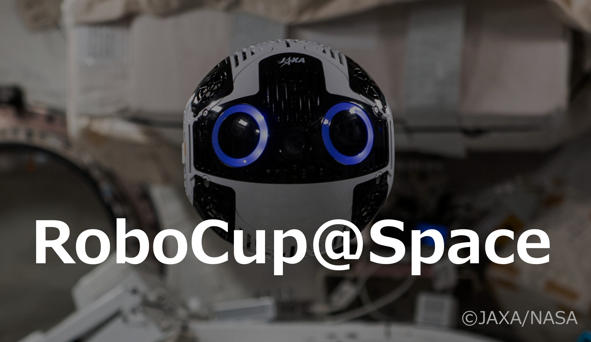
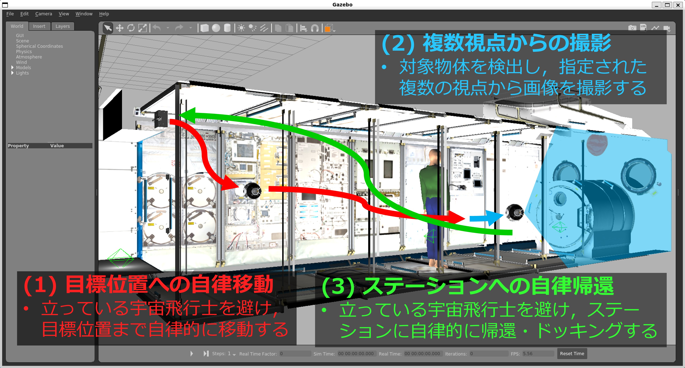
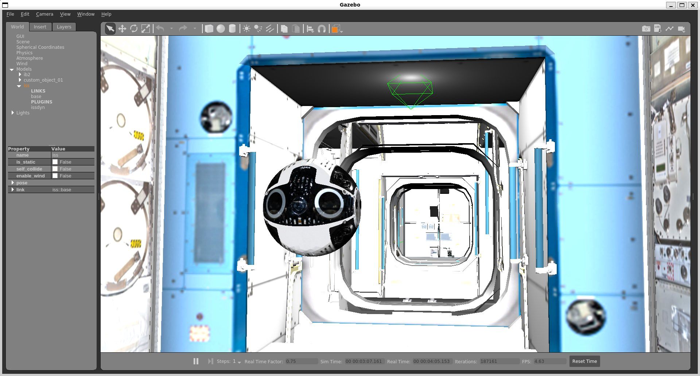

# RoboCup@Space 2026 (第1回)

**RoboCup@Space**は、宇宙における自律型ロボットの発展や社会実装を目指したRoboCup Japan Openを対象とした競技会です。
このリポジトリは、2026年開催予定のRoboCup@Spaceの概要やルールをまとめるためのものになります。

## 目次
1. [**概要**](#概要)
2. [**競技内容**](#競技内容)
3. [**シミュレータ環境**](#シミュレータ環境)
4. [**採点項目**](#採点項目-仮)
5. [**スケジュール**](#スケジュール-仮)
6. [**学会発表情報**](#学会発表情報)
7. [**参考情報**](#参考情報)

 

## 概要
RoboCup@Spaceは、将来の月・惑星探査や軌道上サービスに不可欠な「AI × 宇宙ロボット」技術の発展を目的とした競技会です。自律型ロボットの競技会「RoboCup Japan Open」に新たなカテゴリとして新設しました。
第1回目となる今回は、JAXAが開発したISS搭載ロボットInt-Ball2を用いたシナリオを想定します。JAXAが開発したInt-Ball2のGazeboシミュレータを活用し、自律的な移動やマニピュレーション、協調作業といったタスクを競い合うことで、教育と研究の両面から宇宙ロボット開発の裾野を広げます。まずはシミュレータ上で開催し、将来的には実際の軌道上のISSにあるInt-Ball2を用いた競技へと発展させ、宇宙ロボットに関するベンチマーク構築を目指します。

コミュニティ：Discordサーバー  
・https://discord.gg/nCs4AzANwt

 

## 競技内容

宇宙飛行士の撮影作業の自律的支援タスク
1. 標位置への自律移動
   - ドッキングステーションから目標位置まで自律的に移動する。
   - この際、立っている宇宙飛行士を避ける。

2. 数視点からの撮影
   - 対象物体を検出し，画角の中心になるように撮影する。
   - 指定された複数の視点から画像を撮影する。

3. ステーションへの自律帰還
   - 再度、立っている宇宙飛行士を避ける。
   - ステーションに自律的に帰還し、ドッキングする。

 

## シミュレータ環境
RoboCup@Space 2026では、JAXAが開発したInt-Ball2のGazeboシミュレータを用います。

- [jaxa/int-ball2_simulaton](https://github.com/jaxa/int-ball2_simulaton)  
  - Int-Ball2のシミュレーション環境を提供するリポジトリです。  
  - Gazebo上での動作モデルや制御インターフェースを含み、研究者や開発者がISS船内ロボットの挙動を検証できる環境を整備しています。

- [jaxa/int-ball2_simulator_docker](https://github.com/jaxa/int-ball2_simulator_docker)  
  - Int-Ball2シミュレーションをDocker上で簡単に実行できる環境を提供するリポジトリです。  
  - 環境構築の手間を省き、誰でも容易にシミュレーションを体験できるよう設計されています。

 

## 採点項目 (仮)

| 項目       | 内容                                      | スコア（例）   |
|------------|------------------------------------------|----------------|
| 目標位置到達 | 指定座標に正確に到達したか                 | 10点           |
| 物体検出   | 対象物体を検出できたか                      | 10点           |
| 物体撮影   | 指定された複数視点から撮影できたか           | 5点×5箇所      |
| 自律帰還   | ステーションに戻り、ドッキング成功           | 10点           |
| 障害物回避 | 移動経路で障害物を回避できたか               | 10点×2回       |

 

## スケジュール (仮)

| 年     | 月          | 概要                                                               |
|--------|-------------|-------------------------------------------------------------------|
| 2025年 | 9月         | ロボット学会にてRoboCup Spaceの構想を発表                            |
|        | 10月～12月頃 | Int-Ball2 Gazeboシミュレータの講習会                                |
|        |             | RoboCup@Spaceキックオフミーティング                                 |
| 2026年 | 5月         | 第1回 RoboCup Space 競技会の実施 (シミュレータのみ)                   |
| ：     | ：          | ：                                                                 |
| 2027年 | 5月         | 第2回 RoboCup Space競技会の実施 (実機含む)                           |
| ：     | ：          | ：                                                                 |

 

## 学会発表情報

### 第43回日本ロボット学会 学術講演会 (RSJ2025)

| 発表タイトル | 著者 | 要旨PDF |
|--------------|------|---------|
| RoboCup JapanOpen @Space Challenge の構想 | 萩原 良信 ほか | [📄 要旨PDFを開く](docs/1I1-03.pdf) |
| ISS船内ロボットInt-Ball2による技術実証とRoboCup@Spaceへの展開 | 池田 勇輝 ほか | [📄 要旨PDFを開く](docs/1I1-04.pdf) |

 

## 参考情報
- [RoboCup Japan Official Website](https://www.robocup.or.jp/)
- [無重力空間での自由飛行を進化させる！Int-Ball2が切り開く次世代ロボット技術](https://youtu.be/scgxLm3BY4k)
- [Int-Ball2が宇宙に旅立ちました！](https://humans-in-space.jaxa.jp/news/detail/003155.html)
- [Int-Ball2の初期チェックアウトを実施中！](https://humans-in-space.jaxa.jp/news/detail/003518.html)
- [Int-Ball2自律飛行と自動ドッキング実証実験に成功](https://www.kenkai.jaxa.jp/research/innovation/intball2.html)
- [宇宙で活躍する自律カメラロボット「Int-Ball2」、新たな機能拡張プラットフォームを軌道上で実証完了](https://humans-in-space.jaxa.jp/biz-lab/news/detail/004741.html)
- [「ICHIBAN」国際協力ミッション　国際宇宙ステーションで世界初独自開発したロボット同士の連携実証に成功](https://www.jaxa.jp/press/2025/07/20250731-1_j.html)

 

---

[トップに戻る](#robocupspace-2026-第1回)
